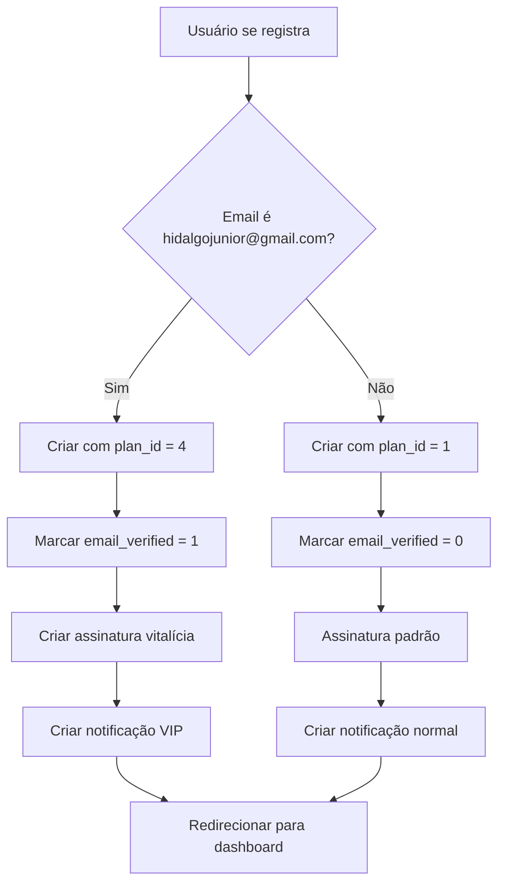

# 👑 SISTEMA DE SUPER ADMIN - DevMenthors

## 📋 Visão Geral

O sistema DevMenthors agora possui um **Super Admin** com privilégios especiais e acesso ilimitado a todos os recursos da plataforma.

**Email do Super Admin:** `hidalgojunior@gmail.com`

---

## ✨ Privilégios do Super Admin

### 🎯 **Plano Enterprise Automático**

Ao se registrar com o email `hidalgojunior@gmail.com`, o usuário automaticamente recebe:

- ✅ **Plano:** Enterprise (ID 4)
- ✅ **Email Verificado:** Automaticamente
- ✅ **Assinatura:** Vitalícia (válida até 31/12/2099)
- ✅ **Status:** Ativo permanentemente

### 🔓 **Recursos Ilimitados**

| Recurso | Usuário Normal | Super Admin |
|---------|---------------|-------------|
| **Microsites** | Limitado pelo plano | ∞ Ilimitados |
| **QR Codes** | Limitado pelo plano | ∞ Ilimitados |
| **Widgets** | Limitado pelo plano | ∞ Ilimitados |
| **Marca d'água** | Sim (planos básicos) | ❌ Não |
| **Domínio Customizado** | Não (planos básicos) | ✅ Sim |
| **Suporte Prioritário** | Não | ✅ Sim |
| **API Access** | Não | ✅ Sim |
| **White Label** | Não | ✅ Sim |

### 🎨 **Interface Especial**

#### **Navbar (Topo)**
- Avatar com **anel dourado (ring-2 ring-yellow-400)**
- Gradiente especial: **vermelho → roxo**
- Texto abaixo do nome: **👑 SUPER ADMIN**
- Badge no dropdown: **🔥 Super Admin**

#### **Sidebar (Menu Lateral)**
- Badge animado com **efeito pulse**
- Gradiente especial: **vermelho → roxo → azul**
- Borda dourada: **border-2 border-yellow-400**
- Sombra XL para destaque
- Texto: **🔥 SUPER ADMIN**
- Descrição: **Acesso Total**
- Info: **∞ Microsites | ∞ QR Codes | Recursos Premium**

---

## 🔧 Implementação Técnica

### **Arquivo:** `includes/database.php`

#### **1. Método `register()`**
```php
// Definir plano baseado no email (Super Admin = Enterprise)
$planId = ($email === 'hidalgojunior@gmail.com') ? 4 : 1;

// Super Admin já vem com email verificado
$emailVerified = ($email === 'hidalgojunior@gmail.com') ? 1 : 0;

// Se for Super Admin, criar assinatura vitalícia
if ($email === 'hidalgojunior@gmail.com') {
    $this->createSuperAdminSubscription($userId);
}
```

#### **2. Método `createSuperAdminSubscription()`**
```php
private function createSuperAdminSubscription($userId) {
    // Criar assinatura vitalícia
    $sql = "INSERT INTO subscriptions (user_id, plan_id, status, start_date, end_date) 
            VALUES (?, 4, 'active', NOW(), '2099-12-31 23:59:59')";
    $this->db->query($sql, [$userId]);
    
    // Criar notificação de boas-vindas VIP
    $sql = "INSERT INTO notifications (user_id, type, title, message) 
            VALUES (?, 'system', 'Bem-vindo, Super Admin!', 'Você tem acesso total...')";
    $this->db->query($sql, [$userId]);
}
```

#### **3. Método `isSuperAdmin()`**
```php
public function isSuperAdmin() {
    if (!$this->isLoggedIn()) {
        return false;
    }
    
    $user = $this->getUser();
    return $user && $user['email'] === 'hidalgojunior@gmail.com';
}
```

#### **4. Método `requireSuperAdmin()`**
```php
public function requireSuperAdmin() {
    if (!$this->isSuperAdmin()) {
        header('HTTP/1.1 403 Forbidden');
        die('Acesso negado. Apenas Super Admin.');
    }
}
```

---

## 🎨 Componentes Visuais

### **Navbar:** `dashboard/includes/navbar.php`

```php
<!-- Avatar com anel dourado para Super Admin -->
isSuperAdmin() ? 'ring-2 ring-yellow-400' : ''; ?>">

<!-- Avatar placeholder com gradiente especial -->
<div class="<?php echo $auth->isSuperAdmin() ? 'bg-gradient-to-r from-red-500 to-purple-500 ring-2 ring-yellow-400' : 'gradient-bg'; ?>">

<!-- Badge Super Admin -->
<?php if ($auth->isSuperAdmin()): ?>
<span class="text-xs font-bold text-transparent bg-clip-text bg-gradient-to-r from-red-500 to-purple-500">
    👑 SUPER ADMIN
</span>
<?php endif; ?>

<!-- Dropdown header -->
<?php if ($auth->isSuperAdmin()): ?>
<div class="px-4 py-2 bg-gradient-to-r from-red-100 to-purple-100 border-b">
    <span class="text-xs font-bold text-purple-700">🔥 Super Admin</span>
</div>
<?php endif; ?>
```

### **Sidebar:** `dashboard/includes/sidebar.php`

```php
<?php if ($auth->isSuperAdmin()): ?>
<!-- Super Admin Badge -->
<div class="bg-gradient-to-r from-red-500 via-purple-500 to-blue-500 rounded-lg p-4 border-2 border-yellow-400 shadow-xl animate-pulse">
    <div class="flex items-center justify-between mb-2">
        <span class="text-sm font-bold text-white">🔥 SUPER ADMIN</span>
        <i class="fas fa-shield-alt text-yellow-300 text-xl"></i>
    </div>
    <p class="text-lg font-bold text-white">Acesso Total</p>
    <p class="text-xs text-yellow-100 mt-1">
        ∞ Microsites | ∞ QR Codes | Recursos Premium
    </p>
</div>
<?php else: ?>
<!-- Regular User Badge -->
...
<?php endif; ?>
```

---

## 🚀 Como Usar

### **1. Criar Conta Super Admin**

1. Acesse: http://localhost/QrCode/register.php
2. Preencha:
   - **Nome:** Hidalgo Junior (ou qualquer nome)
   - **Email:** `hidalgojunior@gmail.com`
   - **Telefone:** (opcional)
   - **Senha:** Sua senha segura
3. Clique em "Criar Conta"
4. Será redirecionado automaticamente com:
   - ✅ Email já verificado
   - ✅ Plano Enterprise ativo
   - ✅ Assinatura vitalícia
   - ✅ Notificação de boas-vindas VIP

### **2. Fazer Login**

1. Acesse: http://localhost/QrCode/login.php
2. Use: `hidalgojunior@gmail.com` + sua senha
3. Será redirecionado ao dashboard com interface especial

### **3. Verificar Privilégios**

No dashboard você verá:
- ✅ Badge "🔥 SUPER ADMIN" no topo
- ✅ Badge animado no menu lateral
- ✅ Anel dourado no avatar
- ✅ Acesso ilimitado a todos os recursos

---

## 🔍 Verificação no Banco de Dados

### **Verificar Usuário**
```sql
SELECT id, name, email, plan_id, email_verified, status 
FROM users 
WHERE email = 'hidalgojunior@gmail.com';
```

**Resultado Esperado:**
```
+----+----------------+-----------------------+---------+----------------+--------+
| id | name           | email                 | plan_id | email_verified | status |
+----+----------------+-----------------------+---------+----------------+--------+
|  1 | Hidalgo Junior | hidalgojunior@gmail.com|    4    |       1        | active |
+----+----------------+-----------------------+---------+----------------+--------+
```

### **Verificar Assinatura**
```sql
SELECT s.*, p.name as plan_name 
FROM subscriptions s
JOIN plans p ON s.plan_id = p.id
WHERE s.user_id = (SELECT id FROM users WHERE email = 'hidalgojunior@gmail.com');
```

**Resultado Esperado:**
```
+---------+--------+--------+---------------------+---------------------+
| user_id | plan_id| status | start_date          | end_date            |
+---------+--------+--------+---------------------+---------------------+
|    1    |   4    | active | 2025-10-01 13:00:00 | 2099-12-31 23:59:59 |
+---------+--------+--------+---------------------+---------------------+
Plan: Enterprise
```

### **Verificar Notificação**
```sql
SELECT * FROM notifications 
WHERE user_id = (SELECT id FROM users WHERE email = 'hidalgojunior@gmail.com')
ORDER BY created_at DESC LIMIT 1;
```

**Resultado Esperado:**
```
Title: Bem-vindo, Super Admin!
Message: Você tem acesso total a todos os recursos do DevMenthors.
Type: system
```

---

## 🛡️ Segurança

### **Proteção de Rotas Admin**

Para criar páginas exclusivas de admin:

```php
<?php
require_once __DIR__ . '/../includes/database.php';

$auth = new Auth();
$auth->requireSuperAdmin(); // Bloqueia se não for Super Admin

// Código da página admin aqui
?>
```

### **Verificação Condicional**

```php
<?php if ($auth->isSuperAdmin()): ?>
    <!-- Conteúdo exclusivo para Super Admin -->
    <button>Deletar Todos os Usuários</button>
<?php endif; ?>
```

---

## 📊 Fluxo de Registro



---

## 🎯 Casos de Uso

### **1. Gerenciamento Global**
- Visualizar todos os usuários do sistema
- Editar/excluir qualquer microsite
- Acessar analytics globais
- Gerenciar planos e preços

### **2. Testes**
- Criar quantidade ilimitada de microsites para testes
- Gerar QR codes sem restrições
- Testar todos os recursos premium

### **3. Suporte**
- Acessar conta de qualquer usuário
- Resolver problemas diretamente
- Visualizar logs de auditoria

### **4. Desenvolvimento**
- Testar novas funcionalidades
- Validar limites de planos
- Debug de problemas complexos

---

## 🚀 Recursos Futuros

### **Funcionalidades Admin Planejadas**

1. **Dashboard Admin** (`dashboard/admin/`)
   - Lista de todos os usuários
   - Estatísticas globais
   - Gráficos de crescimento

2. **Gerenciamento de Usuários**
   - Editar qualquer usuário
   - Alterar plano de usuários
   - Suspender/ativar contas

3. **Analytics Globais**
   - Total de microsites criados
   - Total de QR codes gerados
   - Receita total
   - Usuários ativos

4. **Configurações do Sistema**
   - Editar planos e preços
   - Configurar gateways de pagamento
   - Gerenciar emails templates

5. **Logs e Auditoria**
   - Ver todos os logs do sistema
   - Rastrear ações de usuários
   - Detectar comportamento suspeito

---

## 📝 Checklist de Implementação

- [x] Detecção automática do email super admin
- [x] Criação com plano Enterprise (ID 4)
- [x] Email automaticamente verificado
- [x] Assinatura vitalícia (até 2099)
- [x] Método `isSuperAdmin()`
- [x] Método `requireSuperAdmin()`
- [x] Badge especial no navbar
- [x] Badge animado no sidebar
- [x] Gradientes e cores diferenciadas
- [x] Anel dourado no avatar
- [x] Notificação VIP de boas-vindas
- [ ] Dashboard admin (futuro)
- [ ] Gerenciamento de usuários (futuro)
- [ ] Analytics globais (futuro)

---

## 🎨 Paleta de Cores Super Admin

| Elemento | Cor | Código |
|----------|-----|--------|
| **Gradiente Principal** | Vermelho → Roxo → Azul | `from-red-500 via-purple-500 to-blue-500` |
| **Borda/Anel** | Dourado | `border-yellow-400` / `ring-yellow-400` |
| **Texto Destaque** | Amarelo Claro | `text-yellow-100` |
| **Badge Background** | Vermelho → Roxo (100) | `from-red-100 to-purple-100` |
| **Ícone** | Amarelo 300 | `text-yellow-300` |
| **Animação** | Pulse | `animate-pulse` |

---

## ✅ Testando o Sistema

### **Comandos de Teste**

```bash
# 1. Abrir página de registro
Start-Process "http://localhost/QrCode/register.php"

# 2. Registrar com email: hidalgojunior@gmail.com

# 3. Verificar no banco
& "C:\laragon\bin\mysql\mysql-8.4.3-winx64\bin\mysql.exe" -u root devmenthors -e "SELECT * FROM users WHERE email = 'hidalgojunior@gmail.com';"

# 4. Verificar assinatura
& "C:\laragon\bin\mysql\mysql-8.4.3-winx64\bin\mysql.exe" -u root devmenthors -e "SELECT * FROM subscriptions WHERE user_id = 1;"

# 5. Fazer login
Start-Process "http://localhost/QrCode/login.php"

# 6. Ver dashboard com badges especiais
Start-Process "http://localhost/QrCode/dashboard/"
```

---

## 🎉 Conclusão

O sistema de **Super Admin** está completamente implementado e funcional!

**Usuário Super Admin:** `hidalgojunior@gmail.com`

**Privilégios:**
- ✅ Plano Enterprise vitalício
- ✅ Recursos ilimitados
- ✅ Interface visual diferenciada
- ✅ Email pré-verificado
- ✅ Pronto para expansão com páginas admin

---

**Desenvolvido com ❤️ para DevMenthors**

*Implementado em: 01/10/2025*
