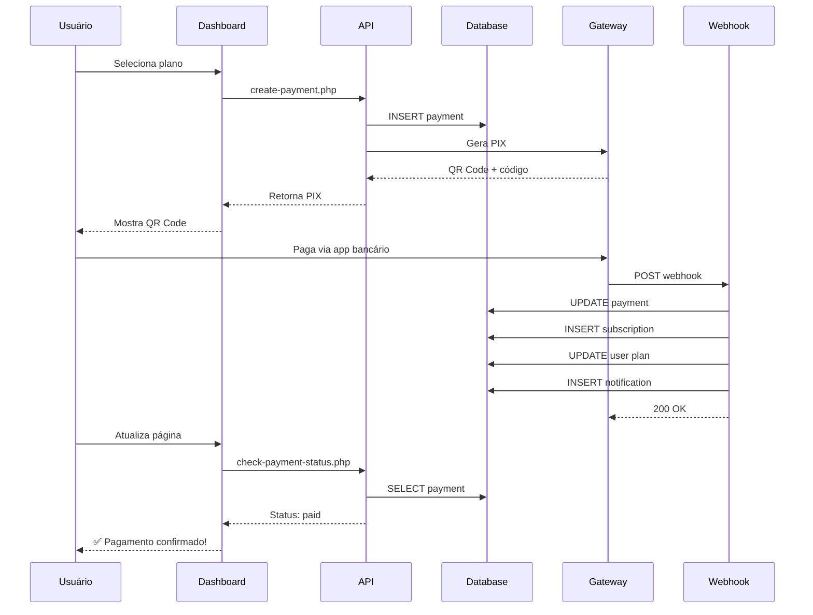

# 🔔 SISTEMA DE WEBHOOK DE PAGAMENTO PIX

## 📋 Visão Geral

Sistema completo de webhook para confirmação automática de pagamentos PIX no DevMenthors.

---

## 🎯 Componentes Implementados

### 1️⃣ **api/webhook-payment.php** (Receptor de Webhook)

Endpoint principal que recebe notificações dos gateways de pagamento.

#### **Recursos:**
- ✅ Validação de IP de origem
- ✅ Validação de assinatura HMAC SHA256
- ✅ Suporte a múltiplos status (paid, approved, confirmed, expired, cancelled)
- ✅ Transações atômicas no banco
- ✅ Log completo de todas as requisições
- ✅ Processamento idempotente (evita duplo processamento)

#### **Fluxo de Processamento (Status: PAID):**

```
1. Receber POST com JSON
2. Validar IP e assinatura
3. Buscar pagamento no banco
4. Verificar se já foi processado
5. Iniciar transação
   ├─ Atualizar status do pagamento
   ├─ Criar/estender assinatura
   ├─ Atualizar plano do usuário
   ├─ Criar notificação
   └─ Registrar em audit_logs
6. Commit da transação
7. Retornar sucesso
```

#### **Segurança:**

| Camada | Implementação |
|--------|---------------|
| **IP Whitelist** | IPs permitidos configuráveis |
| **HMAC SHA256** | Assinatura de payload |
| **Headers** | X-Webhook-Signature |
| **Rate Limiting** | Via gateway (recomendado) |
| **Logs** | Todas requisições registradas |

---

### 2️⃣ **api/check-payment-status.php** (Verificação de Status)

API para polling manual do status de pagamento.

#### **Recursos:**
- ✅ Autenticação via sessão
- ✅ Retorna status atualizado
- ✅ Detecta pagamentos expirados
- ✅ Inclui dados da assinatura (se paga)
- ✅ Flags de ações disponíveis

#### **Exemplo de Resposta:**
```json
{
  "success": true,
  "payment": {
    "id": 1,
    "status": "paid",
    "amount": 20.00,
    "plan_name": "Starter",
    "created_at": "2025-10-01 14:30:00",
    "expires_at": "2025-10-01 15:30:00",
    "paid_at": "2025-10-01 14:35:00",
    "is_expired": false,
    "transaction_id": "TXN_1234567890"
  },
  "subscription": {
    "id": 5,
    "status": "active",
    "start_date": "2025-10-01 14:35:00",
    "end_date": "2025-11-01 14:35:00"
  },
  "actions": {
    "can_retry": false,
    "can_cancel": false,
    "is_active": true
  }
}
```

---

### 3️⃣ **api/test-payment-confirmation.php** (Interface de Teste)

Página HTML completa para simular webhooks e testar o sistema.

#### **Funcionalidades:**

##### **Formulário de Teste:**
- Payment ID (do banco de dados)
- Status (paid, approved, expired, cancelled, etc)
- Amount (valor em R$)
- Transaction ID (gerado automaticamente)
- Webhook Secret (para assinatura HMAC)

##### **Ações Rápidas:**
- ✅ Simular Pagamento Aprovado
- ⏰ Simular Pagamento Expirado
- 📋 Ver Logs do Webhook

##### **Lista de Pagamentos:**
- Carrega pagamentos recentes
- Clique para preencher formulário
- Status visual com cores

##### **Visualização de Resposta:**
- Status HTTP
- Headers enviados
- Request completo
- Response do servidor
- Formatação JSON colorida

---

### 4️⃣ **api/list-payments.php** (Listagem de Pagamentos)

API auxiliar para listar pagamentos (usada pela interface de teste).

#### **Retorna:**
- Últimos 10 pagamentos
- Dados do usuário
- Dados do plano
- Status e valores

---

### 5️⃣ **logs/** (Sistema de Logs)

Diretório para armazenar logs de webhook.

#### **Formato de Log:**
```json
{
  "timestamp": "2025-10-01 14:35:00",
  "method": "POST",
  "ip": "127.0.0.1",
  "user_agent": "Gateway/1.0",
  "headers": {
    "Content-Type": "application/json",
    "X-Webhook-Signature": "abc123..."
  },
  "body": "{\"payment_id\":1,\"status\":\"paid\",...}"
}
```

#### **Arquivos:**
- `webhook-2025-10-01.log` (por dia)
- Rotação automática diária
- Retenção recomendada: 30 dias

---

## 🔒 Configuração de Segurança

### **1. Webhook Secret**

Defina no `.env`:
```env
WEBHOOK_SECRET=sua_chave_secreta_super_forte_aqui_2025
```

**Geração de Secret Forte:**
```bash
# Linux/Mac
openssl rand -hex 32

# PowerShell (Windows)
[Convert]::ToBase64String((1..32 | ForEach-Object { Get-Random -Maximum 256 }))
```

### **2. IP Whitelist**

Edite `api/webhook-payment.php`:
```php
define('ALLOWED_IPS', [
    '177.12.34.56', // IP do Mercado Pago
    '187.45.67.89', // IP do PagSeguro
    '179.23.45.67', // IP do Asaas
]);
```

### **3. HTTPS Obrigatório**

Em produção, sempre use HTTPS:
```php
if ($_SERVER['HTTPS'] !== 'on') {
    http_response_code(403);
    die('HTTPS obrigatório');
}
```

---

## 🧪 Como Testar

### **Passo 1: Criar um Pagamento**

```sql
-- Via dashboard ou criar manualmente no banco:
INSERT INTO payments (user_id, plan_id, amount, status, pix_code, expires_at)
VALUES (1, 2, 20.00, 'pending', 'PIX_CODE_AQUI', DATE_ADD(NOW(), INTERVAL 1 HOUR));
```

### **Passo 2: Abrir Interface de Teste**

```
http://localhost/QrCode/api/test-payment-confirmation.php
```

### **Passo 3: Preencher Formulário**

1. **Payment ID:** 1 (ou o ID criado)
2. **Status:** paid
3. **Amount:** 20.00
4. **Transaction ID:** (clique em "Gerar automaticamente")
5. **Webhook Secret:** (já preenchido)

### **Passo 4: Enviar Webhook**

Clique em "Enviar Webhook" e veja a resposta.

### **Passo 5: Verificar Resultados**

#### **No Banco de Dados:**
```sql
-- Pagamento atualizado
SELECT * FROM payments WHERE id = 1;
-- Status deve ser 'paid'

-- Assinatura criada
SELECT * FROM subscriptions WHERE user_id = 1;
-- Status deve ser 'active'

-- Usuário com plano atualizado
SELECT id, name, plan_id FROM users WHERE id = 1;
-- plan_id deve ser 2 (Starter)

-- Notificação criada
SELECT * FROM notifications WHERE user_id = 1 ORDER BY created_at DESC LIMIT 1;

-- Log de auditoria
SELECT * FROM audit_logs WHERE action = 'payment_confirmed' ORDER BY created_at DESC LIMIT 1;
```

---

## 🔗 Integração com Gateways Reais

### **Mercado Pago**

#### **1. Configurar Webhook:**
```
URL: https://seudominio.com/QrCode/api/webhook-payment.php
Eventos: payment (atualização de pagamento)
```

#### **2. Adaptar Payload:**
```php
// No webhook-payment.php, adicionar:
if (isset($data['type']) && $data['type'] === 'payment') {
    // Buscar detalhes do pagamento via API do MP
    $mpPaymentId = $data['data']['id'];
    // ... implementar busca na API
}
```

#### **3. Validar Assinatura:**
```php
// Mercado Pago usa x-signature header
$signature = $_SERVER['HTTP_X_SIGNATURE'] ?? null;
// Validar conforme docs do MP
```

---

### **PagSeguro**

#### **1. Configurar Notificação:**
```
URL: https://seudominio.com/QrCode/api/webhook-payment.php
Token: configurar no painel
```

#### **2. Processar Notificação:**
```php
// PagSeguro envia POST com notificationCode
$notificationCode = $data['notificationCode'];
// Buscar transação via API do PagSeguro
```

---

### **Asaas**

#### **1. Configurar Webhook:**
```
URL: https://seudominio.com/QrCode/api/webhook-payment.php
Evento: PAYMENT_CONFIRMED
```

#### **2. Validar Token:**
```php
$token = $_SERVER['HTTP_ASAAS_ACCESS_TOKEN'] ?? null;
// Validar com seu access token
```

---

## 📊 Fluxo Completo de Pagamento



---

## 🐛 Troubleshooting

### **Webhook não está sendo recebido**

1. Verificar se a URL está acessível externamente
2. Verificar logs do servidor (404, 500, etc)
3. Verificar firewall/bloqueio de IP
4. Testar com cURL:
   ```bash
   curl -X POST https://seudominio.com/QrCode/api/webhook-payment.php \
     -H "Content-Type: application/json" \
     -H "X-Webhook-Signature: abc123" \
     -d '{"payment_id":1,"status":"paid","amount":20.00,"transaction_id":"TXN_123"}'
   ```

### **Assinatura inválida**

1. Verificar se o secret está correto no `.env`
2. Verificar se o gateway está enviando o header correto
3. Verificar se o payload está sendo lido corretamente
4. Testar sem assinatura primeiro (em dev)

### **Pagamento não está sendo atualizado**

1. Verificar logs em `logs/webhook-YYYY-MM-DD.log`
2. Verificar se o payment_id existe no banco
3. Verificar se já foi processado (status = 'paid')
4. Verificar erros no response do webhook

### **Duplicação de assinatura**

1. O código já trata isso (verifica assinatura ativa)
2. Se ocorrer, verificar lógica em `processPayment()`
3. Assinatura existente é estendida, não duplicada

---

## 📈 Melhorias Futuras

### **Fila de Processamento**
```php
// Adicionar webhook a uma fila (Redis, RabbitMQ, etc)
// Processar de forma assíncrona
// Retry automático em caso de falha
```

### **Retry Policy**
```php
// Se processamento falhar, tentar novamente
// Exponential backoff: 1s, 2s, 4s, 8s, 16s
// Limite de 5 tentativas
```

### **Webhook Outbound**
```php
// Enviar webhook para sistema externo do cliente
// Notificar sobre novos pagamentos
// Útil para integrações
```

### **Dashboard de Webhooks**
```php
// Página admin para ver todos os webhooks recebidos
// Status, payload, response, tentativas
// Reprocessar manualmente
```

---

## ✅ Checklist de Implementação

- [x] api/webhook-payment.php criado
- [x] Validação de IP implementada
- [x] Validação de assinatura HMAC SHA256
- [x] Processamento de pagamento confirmado
- [x] Processamento de pagamento expirado/cancelado
- [x] Transações atômicas
- [x] Logs completos
- [x] api/check-payment-status.php criado
- [x] api/test-payment-confirmation.php criado
- [x] api/list-payments.php criado
- [x] Diretório logs/ criado
- [x] Documentação completa
- [ ] Integração com gateway real (Mercado Pago/PagSeguro/Asaas)
- [ ] Sistema de email (notificar usuário)
- [ ] Retry policy (reprocessamento automático)
- [ ] Dashboard de webhooks (admin)

---

## 🎯 Comandos de Teste

### **Teste Manual via cURL**

```bash
# Simular pagamento aprovado
curl -X POST http://localhost/QrCode/api/webhook-payment.php \
  -H "Content-Type: application/json" \
  -d '{
    "payment_id": 1,
    "status": "paid",
    "amount": 20.00,
    "transaction_id": "TXN_TEST_123"
  }'

# Verificar status
curl http://localhost/QrCode/api/check-payment-status.php?payment_id=1
```

### **Verificar no Banco**

```sql
-- Ver pagamento
SELECT * FROM payments WHERE id = 1;

-- Ver assinatura
SELECT s.*, p.name as plan_name 
FROM subscriptions s
JOIN plans p ON s.plan_id = p.id
WHERE s.user_id = 1;

-- Ver notificações
SELECT * FROM notifications WHERE user_id = 1 ORDER BY created_at DESC LIMIT 5;

-- Ver logs de auditoria
SELECT * FROM audit_logs WHERE action = 'payment_confirmed' ORDER BY created_at DESC LIMIT 5;
```

### **Ver Logs**

```bash
# PowerShell (Windows)
Get-Content "c:\laragon\www\QrCode\logs\webhook-$(Get-Date -Format 'yyyy-MM-dd').log"

# Bash (Linux/Mac)
tail -f logs/webhook-$(date +%Y-%m-%d).log
```

---

## 🚀 Próximos Passos

1. **Escolher Gateway de Pagamento:**
   - Mercado Pago (recomendado)
   - PagSeguro
   - Asaas
   - Outro

2. **Implementar Integração:**
   - Instalar SDK oficial
   - Adaptar create-payment.php
   - Adaptar webhook-payment.php
   - Testar em sandbox

3. **Sistema de Email:**
   - Instalar PHPMailer
   - Criar templates HTML
   - Notificar pagamento confirmado
   - Notificar vencimento próximo

4. **Deploy em Produção:**
   - Configurar HTTPS (SSL)
   - Configurar IP whitelist
   - Testar webhook no ambiente real
   - Monitorar logs

---

**Desenvolvido com ❤️ para DevMenthors**

*Implementado em: 01/10/2025*
*Status: ✅ Pronto para Testes*
